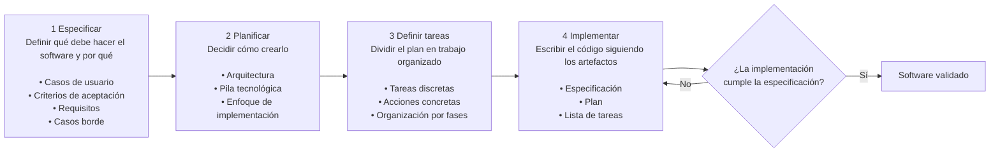

# Spec Driven Development

## Introducción

Spec Driven Development (SDD) es un enfoque estructurado para el desarrollo de software que trata las especificaciones como la fuente de verdad, no como documentación auxiliar o descartable. Cuando se usa SDD con asistentes de codificación basados en IA, la especificación guía directamente la generación de código y ayuda a que la implementación coincida con el comportamiento previsto desde el principio.

El objetivo no es producir más documentación por formalidad, sino crear artefactos claros, versionables y accionables. Estos artefactos permiten que personas y agentes de IA trabajen con el mismo contexto: requisitos, decisiones técnicas, tareas y código quedan conectados durante todo el ciclo de desarrollo.

## Resumen ejecutivo

SDD propone que la especificación sea el artefacto principal del desarrollo: primero se define con claridad qué debe hacer el software, luego se planifica cómo construirlo, después se divide el trabajo en tareas y finalmente se implementa. Este enfoque reduce ambigüedades y hace que la IA genere código con mejor contexto.

GitHub Spec Kit operacionaliza este flujo mediante archivos versionables como `constitution.md`, `spec.md`, `plan.md` y `tasks.md`, junto con comandos `/speckit.*` que guían cada fase. El valor está en mantener trazabilidad entre intención, decisiones técnicas, trabajo ejecutable y código.

La idea central para aplicar SDD es sencilla: no pedirle a la IA que "construya algo" de una vez, sino darle artefactos progresivos y verificables. Primero se aclaran requisitos, luego se valida el diseño, después se generan tareas pequeñas y finalmente se implementa de forma incremental.

## Conceptos básicos de SDD

### Principios

En el desarrollo tradicional, el código suele convertirse en la fuente de verdad: las especificaciones sirven al código y con frecuencia se vuelven obsoletas a medida que evoluciona la implementación. SDD invierte esa relación: **las especificaciones se convierten en el artefacto principal y el código cumple con las especificaciones**. Este cambio permite mantener alineadas la intención, el diseño y la implementación.

SDD se apoya en cuatro principios básicos:

1. **Especificaciones como artefacto principal**: la especificación es la fuente central de verdad. El código es su expresión en un lenguaje, una pila tecnológica y una arquitectura concretas. Mantener el software implica evolucionar las especificaciones, no solo aplicar cambios al código.

2. **Especificaciones ejecutables**: las especificaciones deben ser precisas, completas e inequívocas para que la IA pueda transformarlas en planes, tareas y código. Esta precisión reduce la brecha entre la intención y la implementación.

3. **Documentación dinámica**: depurar puede significar corregir especificaciones que generan código incorrecto. Refactorizar también puede significar reorganizar especificaciones para mejorar claridad. Las especificaciones permanecen sincronizadas con la implementación.

4. **Colaboración humano-IA**: la IA transforma especificaciones en código, pero la generación sin revisión ni estructura produce resultados inconsistentes. SDD proporciona esa estructura mediante especificaciones, planes y tareas verificables.

### Flujo de trabajo de cuatro fases

El flujo de trabajo de SDD se organiza en cuatro fases:

1. **Especificar**: definir qué debe hacer el software y por qué. Incluye historias de usuario, criterios de aceptación, requisitos y casos límite.
2. **Planificar**: decidir cómo construirlo. Incluye arquitectura, pila tecnológica y enfoque de implementación.
3. **Definir tareas**: dividir el plan en trabajo organizado, discreto y accionable.
4. **Implementar**: escribir el código siguiendo la especificación, el plan y la lista de tareas.



Cada fase genera artefactos que alimentan la siguiente. Así se crea una ruta rastreable desde los requisitos hasta el código funcional.

## GitHub Spec Kit

GitHub Spec Kit es un conjunto de herramientas de código abierto para aplicar SDD con agentes de IA. Resuelve un problema central del desarrollo asistido por IA: mantener contexto, coherencia y trazabilidad a través de múltiples interacciones con asistentes de codificación.

En lugar de depender solo del historial de conversación, Spec Kit convierte la intención del producto, las decisiones técnicas y las tareas en archivos Markdown dentro del repositorio.

### Capacidades principales

- **Artefactos persistentes**: las especificaciones, los planes y las tareas se almacenan como archivos Markdown versionables.
- **Flujo de trabajo estandarizado**: un proceso definido guía a los agentes de IA por las fases de especificación, planificación, desglose de tareas e implementación.
- **Comandos reutilizables**: los comandos de barra diagonal encapsulan prácticas de prompting, revisión y generación de artefactos.
- **Trazabilidad**: cada decisión puede relacionarse con una especificación, un plan, una tarea y un cambio en Git.

### Componentes principales

| Componente | Propósito |
| --- | --- |
| `specify` CLI | Inicializa y gestiona proyectos basados en especificaciones. |
| `constitution.md` | Define principios, restricciones y estándares del proyecto. |
| `spec.md` | Describe qué debe hacer una funcionalidad desde la perspectiva de requisitos. |
| `plan.md` | Traduce la especificación en arquitectura, decisiones técnicas y secuencia de implementación. |
| `tasks.md` | Divide el plan en tareas concretas y ejecutables. |
| Comandos `/speckit.*` | Invocan los flujos de trabajo de GitHub Spec Kit. |

### Tabla de artefactos

| Artefacto | Se genera o actualiza con | Propósito | Pregunta que responde |
| --- | --- | --- | --- |
| `constitution.md` | `/speckit.constitution` | Define principios, restricciones y estándares no negociables del proyecto. | ¿Qué reglas debe respetar todo el trabajo? |
| `spec.md` | `/speckit.specify` y `/speckit.clarify` | Describe requisitos, historias de usuario, criterios de aceptación y casos límite. | ¿Qué debe hacer la funcionalidad? |
| `plan.md` | `/speckit.plan` | Traduce la especificación en arquitectura, decisiones técnicas y estrategia de implementación. | ¿Cómo se va a construir? |
| `tasks.md` | `/speckit.tasks` | Convierte el plan en tareas concretas, verificables y secuenciadas. | ¿Qué se debe ejecutar paso a paso? |
| Código y pruebas | `/speckit.implement` | Implementa tareas usando `spec.md`, `plan.md` y `tasks.md` como contexto. | ¿La implementación cumple lo especificado? |

### Seguimiento de funcionalidades

En flujos de trabajo basados en Git, Spec Kit infiere la funcionalidad activa a partir del nombre de la rama. Si se trabaja en la rama `document-upload`, Spec Kit opera automáticamente con el directorio asociado a esa funcionalidad.

Para flujos de trabajo que no usan Git, o para flujos manuales, Spec Kit puede usar variables de entorno. La variable `SPECIFY_FEATURE` indica el directorio de la funcionalidad activa. Este seguimiento garantiza que, al invocar `/speckit.plan`, la IA lea el archivo `spec.md` correcto y no mezcle requisitos de funcionalidades distintas.

### Integración con Git

Todos los artefactos de Spec Kit son archivos Markdown almacenados en el repositorio. Este enfoque aporta varias ventajas:

- **Seguimiento de cambios**: cada modificación de especificaciones, planes o tareas puede registrarse en un commit. Esto permite revisar la evolución de los requisitos y entender por qué se tomaron ciertas decisiones.
- **Desarrollo basado en ramas**: una rama de funcionalidad puede contener tanto los artefactos de Spec Kit como el código que los implementa. Así se mantienen sincronizados los requisitos y la implementación.
- **Flujo basado en pull request (PR)**: al abrir una PR, se pueden incluir `spec.md`, `plan.md` y `tasks.md` junto con los cambios de código y las pruebas que verifican la implementación.
- **Revisión integral**: durante la revisión de código, los revisores pueden comprobar qué se está creando, cómo se planificó y si el código coincide con la especificación.

### Desarrollo iterativo

Spec Kit soporta desarrollo iterativo mediante una cadena de comandos:

1. Generar una especificación inicial con `/speckit.specify`.
2. Identificar ambigüedades con `/speckit.clarify`.
3. Actualizar la especificación según las respuestas.
4. Crear el plan técnico con `/speckit.plan`.
5. Verificar coherencia con `/speckit.analyze`.
6. Generar tareas con `/speckit.tasks`.
7. Implementar de forma incremental con `/speckit.implement`.

Si los requisitos cambian, se puede volver a fases anteriores, actualizar los artefactos y regenerar los artefactos posteriores. Este ciclo evita que el código avance con supuestos invisibles.

### Comandos opcionales

`/speckit.constitution` establece los principios del proyecto. En proyectos existentes, ayuda a documentar patrones, restricciones arquitectónicas y estándares ya adoptados.

`/speckit.clarify` analiza una especificación para identificar ambigüedades, detalles faltantes y casos límite insuficientemente especificados. Después de generar una especificación inicial, este comando permite que la IA formule preguntas aclaratorias antes de planificar o implementar.

`/speckit.analyze` realiza una comprobación de coherencia entre artefactos. Verifica que el plan implemente todos los requisitos de la especificación, que las tareas cubran todos los elementos del plan y que todo se ajuste a la constitución.

`/speckit.checklist` genera listas de verificación de calidad basadas en las especificaciones. Estas listas ayudan a revisar exhaustividad, claridad y coherencia, como si fueran pruebas de calidad en texto.

### Tabla de comandos

| Comando                 | Cuándo usarlo                                          | Entrada principal                                                     | Salida esperada                                         |
| ----------------------- | ------------------------------------------------------ | --------------------------------------------------------------------- | ------------------------------------------------------- |
| `/speckit.constitution` | Al iniciar un proyecto o documentar reglas existentes. | Principios, estándares, restricciones y decisiones del equipo.        | `constitution.md` actualizado.                          |
| `/speckit.specify`      | Al definir una nueva funcionalidad.                    | Descripción funcional desde la perspectiva del usuario y del negocio. | `spec.md` inicial.                                      |
| `/speckit.clarify`      | Cuando la especificación tiene ambigüedades o huecos.  | `spec.md` y respuestas a preguntas aclaratorias.                      | `spec.md` refinado.                                     |
| `/speckit.plan`         | Cuando la especificación ya es suficientemente clara.  | `spec.md` y `constitution.md`.                                        | `plan.md` con arquitectura y decisiones técnicas.       |
| `/speckit.analyze`      | Antes de generar tareas o implementar.                 | `spec.md`, `plan.md`, `tasks.md` si existe y `constitution.md`.       | Lista de inconsistencias, brechas o conflictos.         |
| `/speckit.checklist`    | Para revisar calidad de requisitos.                    | `spec.md` y criterios de revisión deseados.                           | Checklist de validación.                                |
| `/speckit.tasks`        | Cuando el plan técnico está validado.                  | `spec.md` y `plan.md`.                                                | `tasks.md` con trabajo accionable.                      |
| `/speckit.implement`    | Al ejecutar tareas específicas.                        | `spec.md`, `plan.md`, `tasks.md` y número/rango de tarea.             | Código, pruebas y cambios alineados con los artefactos. |

### Ruta de uso recomendada

Esta ruta resume una forma práctica de usar Spec Kit sin perder trazabilidad entre requisitos, diseño, tareas e implementación.

```markdown
1. Crear o actualizar la constitución del proyecto con `/speckit.constitution`.
2. Crear una especificación inicial con `/speckit.specify`.
3. Ejecutar `/speckit.clarify` hasta resolver ambigüedades relevantes.
4. Revisar que `spec.md` tenga historias, criterios de aceptación, requisitos y casos límite.
5. Generar el plan técnico con `/speckit.plan`.
6. Ejecutar `/speckit.analyze` para detectar inconsistencias entre artefactos.
7. Generar tareas con `/speckit.tasks`.
8. Implementar por partes con `/speckit.implement`, idealmente una tarea o grupo pequeño cada vez.
9. Ejecutar pruebas y revisar que cada cambio cumpla `spec.md`, `plan.md` y `tasks.md`.
10. Si aparece nueva información, actualizar el artefacto correspondiente y regenerar los artefactos dependientes.
```

## Constitución

### Qué es una constitución

Una constitución recoge los principios, restricciones y estándares innegociables que rigen un proyecto. También sirve como guía para el desarrollo asistido por IA. Cuando un agente genera especificaciones, planes, tareas o código, consulta la constitución para verificar que sus propuestas cumplan los estándares acordados. El valor de la constitución está en hacer explícitas las decisiones del equipo para que se apliquen de forma consistente durante todo el flujo de trabajo de SDD.

La constitución suele almacenarse en `constitution.md` y debe ser concreta. Si una regla es importante para el equipo, el producto, la seguridad o el cumplimiento, debe aparecer allí con suficiente claridad para que una persona o una IA puedan aplicarla.

### Beneficios

- **Coherencia**: garantiza alineación con decisiones arquitectónicas en proyectos extensos o con múltiples desarrolladores.
- **Cumplimiento**: hace explícitos y auditables los requisitos normativos, de seguridad y gobernanza.
- **Conocimiento institucional**: conserva lecciones aprendidas y decisiones del equipo en un formato reutilizable.
- **Menor carga cognitiva**: automatiza parte de la aplicación de políticas organizativas durante la generación de especificaciones, planes y código.

### Estructura de una constitución efectiva

Una constitución bien estructurada organiza los principios en categorías fáciles de consultar. Entre las secciones comunes se incluyen:

- Estándares tecnológicos.
- Requisitos de seguridad.
- Rendimiento y escalabilidad.
- Cumplimiento y gobernanza.
- Estándares y directrices de código.

### Ejemplos de estándares

Los estándares tecnológicos especifican tecnologías, plataformas y marcos de trabajo aprobados. Estas restricciones impiden que la IA sugiera tecnologías incompatibles con el proyecto.

```markdown
Estándares tecnológicos

- Todos los recursos de nube deben alojarse en AWS.
- Los servicios de back-end usan NodeJS 20 o una versión posterior.
- Las aplicaciones front-end usan React.
- La base de datos debe ser PostgreSQL, Amazon RDS for PostgreSQL o Amazon Aurora PostgreSQL.
- El almacenamiento de archivos usa Amazon S3.
- La gestión de secretos se realiza exclusivamente con AWS Secrets Manager.
```

Los requisitos de seguridad definen autenticación, autorización, cifrado y reglas de protección de datos. Los requisitos explícitos ayudan a que el código generado incorpore seguridad desde el inicio.

```markdown
Requisitos de seguridad

- Autenticar todas las solicitudes de API con JWT firmado mediante RS256.
- Usar Amazon Cognito, o Amazon Cognito federado con el proveedor corporativo, para emitir y validar tokens.
- Cifrar todos los datos en reposo con AES-256 o cifrado administrado equivalente de AWS.
- Cifrar los datos en tránsito con TLS 1.2 o superior.
- No registrar información personal identificable (PII).
- No almacenar secretos en el código fuente ni en archivos de configuración.
- Implementar control de acceso basado en roles (RBAC) para todas las funcionalidades.
```

Los requisitos de rendimiento y escalabilidad establecen expectativas para el comportamiento del sistema bajo carga.

```markdown
Rendimiento y escalabilidad

- Las API deben responder en menos de 200 ms para el percentil 95 de las solicitudes, sin contar transferencias de archivos grandes.
- El sistema debe soportar 10.000 usuarios concurrentes.
- Usar procesamiento asíncrono para operaciones que superen los 5 segundos.
- Implementar caché para datos consultados con frecuencia.
- Diseñar para escalabilidad horizontal usando servicios aprobados de AWS.
```

Los requisitos de cumplimiento y gobernanza documentan obligaciones normativas, auditoría y políticas internas.

```markdown
Cumplimiento y gobernanza

- Cumplir los estándares locales e internacionales que protegen la información personal.
- Implementar registros de auditoría para todas las modificaciones de datos.
- Soportar estándares de accesibilidad WCAG 2.1 nivel AA.
- Habilitar monitoreo, alertas y trazas con Amazon CloudWatch y AWS X-Ray.
- Conservar registros durante un mínimo de 90 días para auditorías de cumplimiento.
```

Los estándares de código ayudan a garantizar calidad, consistencia y mantenibilidad.

```markdown
Estándares de código

- Seguir las buenas prácticas de NodeJS.
- Mantener una cobertura mínima de pruebas unitarias del 80%.
- Documentar todas las API públicas con JSDoc.
- Usar inyección de dependencias para dependencias de servicios.
- Implementar logging estructurado con Pino Logger.
```

## Especificaciones

### La especificación como fuente de verdad

En SDD, `spec.md` define exactamente qué debe hacer el software. Si una funcionalidad no aparece en la especificación, no debería aparecer en el producto final a menos que la especificación se actualice y se regeneren los artefactos posteriores.

Este enfoque implica un cambio de mentalidad: escribir la especificación es tan importante como escribir código. La especificación no es una formalidad de gestión de proyectos, sino el artefacto que impulsa la generación de código con IA.

Considera la especificación como documentación ejecutable. Al modificar requisitos, se actualiza `spec.md`, se revisa `plan.md` y se regeneran las tareas cuando corresponda. La especificación, versionada en Git, se convierte en el registro oficial de lo que debe lograr cada funcionalidad.

### Estructura de una especificación

Spec Kit organiza las especificaciones en secciones estandarizadas que cubren comportamiento funcional, requisitos de calidad y casos límite:

- **Resumen**: descripción concisa de la funcionalidad desde la perspectiva del usuario final.
- **Historias de usuario**: narrativas breves sobre cómo los usuarios interactúan con la funcionalidad.
- **Criterios de aceptación**: condiciones específicas y verificables que deben cumplirse.
- **Requisitos funcionales**: comportamiento detallado del sistema.
- **Requisitos no funcionales**: atributos de calidad como rendimiento, seguridad, escalabilidad y cumplimiento.
- **Casos límite**: escenarios inusuales, condiciones de error y comportamientos excepcionales.

### Ejemplo de una especificación

El siguiente ejemplo muestra una especificación para una funcionalidad de subida de documentos. 

```markdown
Resumen

Esta funcionalidad permite que los empleados suban documentos PDF y DOCX a su panel personal. Los archivos se almacenan de forma segura en Amazon S3 y aparecen en la lista de documentos del usuario inmediatamente después de la subida.
```

```markdown
Historias de usuario

Como empleado, quiero subir documentos a mi panel para poder acceder a ellos desde cualquier dispositivo.

Como empleado, quiero ver el progreso de subida de archivos grandes para saber que el sistema está procesando mi solicitud.

Como administrador del sistema, quiero que las subidas queden registradas para auditar la actividad de archivos con fines de cumplimiento.
```

```markdown
Criterios de aceptación

- El usuario puede seleccionar archivos PDF o DOCX para subirlos.
- El tamaño máximo de archivo es 50 MB.
- Los archivos mayores de 50 MB muestran un mensaje de error.
- Los tipos de archivo no soportados muestran un mensaje de error.
- Los archivos subidos correctamente aparecen en la lista de documentos en un máximo de 2 segundos.
- El progreso de subida se muestra para archivos mayores de 1 MB.
- Solo los usuarios con rol `Contributor` pueden subir documentos.
- Los archivos subidos se almacenan en prefijos específicos por usuario en Amazon S3.
```

```markdown
Requisitos funcionales

Interfaz de subida

- El panel muestra un botón "Subir documento" en la sección de documentos.
- Al seleccionar "Subir documento", se abre un diálogo de selección de archivo.
- El usuario selecciona un archivo desde su sistema local.
- El sistema valida tipo y tamaño del archivo antes de iniciar la subida.

Proceso de subida

- Los archivos se suben mediante HTTP POST multipart al endpoint `/api/documents`.
- La subida incluye contenido del archivo y metadatos: nombre de archivo, tamaño y tipo de contenido.
- El servidor valida el JWT de Amazon Cognito antes de aceptar la subida.
- El servidor comprueba que el usuario tenga rol `Contributor` antes de procesar la solicitud.

Almacenamiento

- Los archivos se almacenan en el bucket de S3 `employee-documents`.
- El prefijo de S3 sigue el patrón `{userId}/{fileId}/{filename}`.
- El servidor genera un identificador único de archivo para evitar colisiones de nombres.
- Los metadatos del archivo, como nombre original, fecha de subida, ID de usuario, `BucketName` y `ObjectKey`, se almacenan en Amazon RDS for PostgreSQL.

Retroalimentación al usuario

- La barra de progreso se actualiza cada 10% de avance.
- Al completar la subida, se muestra el mensaje: "Documento subido correctamente".
- Se muestran mensajes de error para archivo demasiado grande, tipo no soportado, error de red o error del servidor.
```

```markdown
Requisitos no funcionales

Rendimiento

- Las subidas de archivos menores de 5 MB se completan en menos de 5 segundos en una red típica.
- Las actualizaciones de progreso se muestran con menos de 100 ms de latencia.
- La lista de documentos se actualiza en menos de 1 segundo después de la subida.

Seguridad

- Todas las subidas requieren un JWT válido emitido por Amazon Cognito.
- HTTPS/TLS 1.2 se aplica a toda transmisión de datos.
- Los archivos se escanean contra malware antes del almacenamiento definitivo, como mejora futura.
- No se registra información sensible; puede registrarse el nombre del archivo, pero nunca su contenido.
- Los objetos de Amazon S3 se almacenan en modo privado y no se exponen mediante URL pública.

Escalabilidad

- El sistema soporta hasta 5 subidas simultáneas por usuario.
- El sistema soporta 1.000 usuarios concurrentes subiendo archivos.

Cumplimiento

- El registro de auditoría almacena ID de usuario, nombre de archivo, marca temporal, tamaño de archivo y dirección IP.
- Los registros de auditoría se conservan durante al menos 90 días.
- El sistema soporta solicitudes de eliminación de datos dentro del plazo especificado.
```

```markdown
Casos límite

Interrupción de red durante la subida

- Si la conexión se interrumpe, se muestra el error: "La subida falló por un error de red. Inténtalo de nuevo".
- No quedan cargas multipart incompletas ni objetos parciales en Amazon S3.
- El usuario puede reiniciar la subida desde el principio.

Nombre de archivo duplicado

- El sistema permite nombres de archivo duplicados mediante identificadores únicos de archivo.
- El usuario ve el nombre original del archivo en la lista de documentos.
- El back-end usa identificadores únicos para evitar sobrescrituras.

Límites de capacidad de almacenamiento

- Si se excede un límite de almacenamiento, cuota o política de S3, se muestra el error: "La subida falló por límite de almacenamiento. Contacta a soporte".
- Los errores de almacenamiento se registran para notificación del administrador.

Subidas simultáneas del mismo usuario

- El sistema soporta hasta 5 subidas simultáneas por usuario.
- La sexta subida simultánea queda en cola hasta que una finalice.
- Las barras de progreso se actualizan de forma independiente para cada subida.

Detección de tipo de archivo

- El sistema valida el tipo de archivo por MIME type, no solo por extensión.
- Un archivo con extensión `.pdf` pero contenido que no corresponde a PDF se rechaza.
- Se muestra el error: "El archivo parece estar dañado o tiene un tipo incorrecto".
```

### Escritura de una especificación

Para crear una especificación, se usa `/speckit.specify` con un mensaje que describa la funcionalidad que se quiere crear.

```text
/speckit.specify Crea una nueva funcionalidad de subida de documentos. La funcionalidad debe permitir que los empleados suban documentos PDF o DOCX desde el panel web. Los archivos se almacenan en Amazon S3 bajo un prefijo asociado a la cuenta del usuario. Después de la subida, el archivo aparece en la lista de documentos del usuario. Solo los usuarios con rol `Contributor` pueden subir documentos. El tamaño máximo de archivo es 50 MB. Muestra mensajes de error para archivos demasiado grandes o tipos no soportados. Muestra el progreso de subida para archivos mayores de 1 MB.
```

Esta descripción cubre:

- **Qué**: subir documentos PDF o DOCX.
- **Dónde**: interfaz del panel web.
- **Cómo**: almacenamiento privado en Amazon S3 con prefijo por usuario.
- **Quién**: usuarios con rol `Contributor`.
- **Restricciones**: límite de 50 MB y tipos de archivo específicos.
- **Experiencia de usuario**: progreso visible y mensajes de error.

### Claridad y buenas prácticas

Las ambigüedades en la especificación conducen a implementaciones incorrectas. `/speckit.clarify` ayuda a identificar áreas poco claras y puede ejecutarse varias veces. Cada iteración refina una dimensión distinta:

- Primer paso: brechas funcionales principales.
- Segundo paso: detalles de casos límite.
- Tercer paso: ajuste de requisitos no funcionales.

Para escribir especificaciones claras:

- Reemplaza términos imprecisos por valores medibles. En lugar de "admite archivos grandes", usa "admite archivos de hasta 50 MB".
- Usa terminología coherente. Si la funcionalidad habla de "documentos", evita alternar con "adjuntos" o "archivos" sin justificación.
- Explicita el manejo de errores. Define qué ocurre si Amazon S3 no está disponible, si el usuario no tiene permisos o si la red falla.
- Mantén un alcance adecuado. Si la especificación crece demasiado, divídela en funcionalidades más pequeñas, como "subida de documentos", "descarga de documentos" y "búsqueda de documentos".
- Detalla el qué, no el cómo. Las decisiones de implementación pertenecen al plan, salvo restricciones ya fijadas por la constitución.
- Valida contra la constitución antes de planificar. Las inconsistencias detectadas durante la especificación son más baratas de corregir que después de la implementación.

## Plan técnico

### Separación entre especificación y plan

`plan.md` funciona como documento de diseño. Conecta los requisitos de alto nivel en `spec.md` con las tareas de implementación concretas que vendrán después. Una especificación explica **qué** debe hacer el sistema; el plan explica **cómo** se implementará.

Esta separación es importante. Si la especificación requiere subida de documentos para un portal interno de empleados, allí se definen límites de tamaño, formatos compatibles, retroalimentación de carga y controles de acceso. El plan traduce esos requisitos en decisiones técnicas: qué servicio de almacenamiento usar, cómo estructurar la API, qué mecanismo de autenticación implementar y cómo validar los archivos.

Si se decide cambiar una tecnología, normalmente se actualiza `plan.md`; `spec.md` permanece estable mientras no cambien los requisitos de la funcionalidad.

### Estructura y contenido del plan

Un plan técnico completo suele incluir:

- **Arquitectura**: vista general de componentes e interacciones.
- **Pila tecnológica**: tecnologías, servicios, bibliotecas y razones de selección.
- **Secuencia de implementación**: progresión lógica de los pasos.
- **Verificación de la constitución**: comprobación explícita de cumplimiento.
- **Supuestos y preguntas abiertas**: decisiones pendientes y condiciones asumidas.

### Arquitectura

Esta parte del plan proporciona una vista general de cómo interactúan los componentes. Para la funcionalidad de subida de documentos, la arquitectura podría describirse así:

```markdown
Arquitectura

Implementar un nuevo endpoint de API de back-end `POST /api/documents/upload` para gestionar subidas multipart. El front-end en React incluye un componente `DocumentUpload` con selector de archivos e indicador de progreso. Cuando un usuario selecciona un archivo, el front-end valida tamaño y tipo antes de subirlo. El back-end recibe el archivo, valida nuevamente la solicitud, comprueba autenticación y autorización, almacena el objeto en Amazon S3 y registra los metadatos en Amazon RDS for PostgreSQL. Después de una subida correcta, el front-end actualiza la lista de documentos para mostrar el nuevo archivo.
```

Este resumen establece el flujo general sin entrar en detalles de código. Su objetivo es garantizar que todas las personas comprendan los componentes principales y sus interacciones.

### Pila tecnológica

El plan documenta opciones tecnológicas y razones. Esta sección evita confusiones futuras sobre por qué se seleccionaron servicios, bibliotecas o patrones específicos.

Ejemplo de decisiones tecnológicas:

```markdown
Pila tecnológica y decisiones clave

- **Back-end**: API en NodeJS para gestionar solicitudes de subida de documentos.
- **Front-end**: React 18 con el componente de subida del sistema de diseño existente.
- **Autenticación**: Amazon Cognito con JWT, federado con el proveedor corporativo si aplica.
- **Almacenamiento**: bucket de S3 `employee-documents`, con objetos privados y prefijo `{userId}/{fileId}/{filename}`.
- **Base de datos**: Amazon RDS for PostgreSQL con tabla `DocumentMetadata` y columnas `Id`, `UserId`, `FileName`, `BucketName`, `ObjectKey`, `UploadDate` y `FileSize`.
- **Observabilidad**: Amazon CloudWatch para métricas y logs; AWS X-Ray para trazas de solicitudes.
```

Cada decisión debe alinearse con los requisitos de `spec.md` y los principios de `constitution.md`.

### Secuencia de implementación

El plan describe el orden de los pasos de implementación. Aunque no es tan granular como `tasks.md`, esta secuencia proporciona una progresión lógica desde la base hasta la integración.

Una secuencia típica para la funcionalidad de subida de documentos:

```markdown
Secuencia de implementación

1. Actualizar el esquema de base de datos con la tabla `DocumentMetadata`, índices y restricciones adecuados.
2. Implementar `POST /api/documents/upload` con validación de archivos, integración con Amazon S3 y persistencia de metadatos.
3. Crear el componente `DocumentUpload` con selección de archivos, validación del lado cliente y visualización de progreso.
4. Conectar el front-end con la API, procesar respuestas y actualizar la lista de documentos.
5. Reforzar seguridad con validación de tipo de archivo, límites de tamaño y comprobaciones de autorización del lado servidor.
6. Agregar control de errores para fallas de cliente, red, almacenamiento de objetos, base de datos y servidor.
7. Crear pruebas unitarias para métodos de API y pruebas de integración para el flujo de subida.
```

Esta secuencia garantiza que existan elementos fundamentales antes de implementar componentes dependientes.

### Verificación de la constitución

El plan debe incluir una sección que compruebe explícitamente las soluciones propuestas contra la constitución. Esta revisión evita desviaciones arquitectónicas y garantiza coherencia con los principios del proyecto.

Ejemplo:

```markdown
Verificación de la constitución

- Usa almacenamiento aprobado: Amazon S3.
- Usa base de datos aprobada: Amazon RDS for PostgreSQL.
- Aplica autenticación con Amazon Cognito y autorización por rol antes de aceptar subidas.
- Evita registrar contenido de archivos o información personal identificable.
- Usa Amazon CloudWatch y AWS X-Ray para observabilidad.
- Incluye consideraciones de accesibilidad WCAG 2.1 nivel AA para controles de subida y retroalimentación de progreso.
```

Si el plan propone algo que infringe la constitución, debe corregirse durante la planificación. Detectar estas infracciones durante la revisión de código o en producción es mucho más costoso.

### Supuestos y preguntas abiertas

Los planes bien elaborados documentan supuestos y preguntas sin resolver. Esta transparencia ayuda a identificar problemas antes de comenzar la implementación.

Ejemplos de supuestos:

```markdown
Supuestos

- El bucket de S3 `employee-documents` existe y está configurado para acceso privado.
- La base de datos en Amazon RDS for PostgreSQL tiene capacidad suficiente para almacenar metadatos de documentos.
- El escaneo antivirus de archivos cargados queda fuera del alcance de esta iteración.
```

Ejemplos de preguntas abiertas:

```markdown
Preguntas abiertas

- ¿Los administradores deben poder eliminar documentos subidos por otros usuarios?
- ¿Se necesita registro de auditoría para todos los intentos de acceso a documentos o solo para modificaciones?
- ¿El sistema debe enviar notificaciones por correo electrónico cuando se suban documentos?
```

Si una suposición resulta incorrecta durante la implementación, se debe actualizar `plan.md` y conservar el razonamiento del cambio.

### Revisión, validación e iteración del plan

La generación de un plan es solo el primer paso. La revisión crítica garantiza que el plan sea preciso, completo y alineado con las necesidades del proyecto.

Para revisar cobertura, compara `plan.md` contra `spec.md` de forma sistemática. Todos los requisitos de la especificación deben tener un enfoque de implementación. Por ejemplo, si `spec.md` exige mostrar un mensaje de error para archivos mayores de 50 MB, el plan debe indicar dónde y cómo se valida ese límite.

Para revisar alineación técnica, confirma que las decisiones del plan respeten estándares y procedimientos existentes:

- ¿La arquitectura propuesta encaja con los sistemas actuales?
- ¿Las bibliotecas seleccionadas están aprobadas?
- ¿Las decisiones cumplen las políticas de seguridad y cumplimiento?
- ¿Existe un patrón ya usado para una funcionalidad similar?

Para revisar cumplimiento de la constitución, verifica que no haya conflictos con reglas del proyecto. Las infracciones detectadas durante planificación son fáciles de corregir; las detectadas más tarde suelen ser costosas.

Los planes suelen requerir refinamiento después de la generación inicial. No se debe esperar perfección en el primer intento. Usa `/speckit.clarify` cuando sea necesario aclarar requisitos y actualiza los artefactos resultantes.

Al iterar sobre el plan:

- Sustituye instrucciones vagas como "implementar control de errores adecuado" por descripciones concretas.
- Valida la viabilidad técnica. Por ejemplo, una subida de 50 MB puede requerir streaming, cargas multipart o ajustes de timeout.
- Confirma que el plan aborde rendimiento, seguridad, escalabilidad, mantenimiento, accesibilidad y cumplimiento.
- Busca elementos faltantes, como estrategia de pruebas, observabilidad, manejo de errores y enfoque de reversión.
- Actualiza `plan.md` cuando durante la implementación se detecte que un enfoque no funciona.

Ejemplo de actualización: si el plan proponía guardar el progreso de subida en `localStorage`, pero se detectan problemas en modo incógnito, se actualiza el plan para usar estado en memoria y se documenta la razón. Mantener `plan.md` sincronizado con la implementación real conserva su valor como documentación de referencia.

## Tareas e implementación

### Generación de tareas

Los planes técnicos proporcionan dirección arquitectónica, pero la implementación requiere pasos concretos y accionables. El comando `/speckit.tasks` convierte decisiones de alto nivel en tareas específicas dentro de `tasks.md`. Cada tarea representa una unidad de trabajo discreta que se puede implementar, probar y comprobar de forma independiente.

`/speckit.tasks` procesa tanto `spec.md` como `plan.md`. La IA analiza la especificación para comprender qué se debe crear, revisa el plan para comprender el enfoque arquitectónico y genera tareas que conectan ambos documentos con el código real. El archivo `tasks.md` resultante suele contener tareas numeradas o con viñetas, organizadas por fases cuando la funcionalidad es compleja.

Las tareas bien definidas tienen estos atributos:

- **Accionables**: indican claramente qué hay que hacer.
- **Verificables**: permiten comprobar con facilidad si están completas.
- **Independientes cuando sea posible**: pueden completarse sin esperar trabajo no relacionado.
- **Acotadas**: tienen un tamaño razonable, normalmente de horas a pocos días.

Para la funcionalidad de subida de documentos, el plan describe la arquitectura general. La lista de tareas traduce esas decisiones en acciones específicas: crear una tabla de base de datos, implementar un endpoint de API, crear un componente React, agregar validaciones y escribir pruebas.

### Dependencias y secuenciación

El orden de las tareas importa. Algunas tareas deben completarse antes de que otras puedan comenzar. La lista debe secuenciar el trabajo para minimizar bloqueos.

Por ejemplo, la tabla `DocumentMetadata` debe existir antes de que la API persista metadatos. En cambio, algunas tareas de front-end y back-end pueden avanzar en paralelo si se acuerda un contrato de API estable.

Una buena secuenciación permite:

- Implementar fundamentos antes que componentes dependientes.
- Crear puntos de verificación naturales.
- Probar implementaciones parciales antes de continuar.
- Coordinar mejor el trabajo del equipo.
- Medir progreso con base en tareas completadas.

### Uso de `/speckit.implement`

Una vez validado, `tasks.md` se convierte en la hoja de ruta de implementación. El comando `/speckit.implement` usa `tasks.md` para generar código de forma sistemática.

Se puede invocar `/speckit.implement` con un número de tarea específico, un rango de tareas o una descripción tomada de `tasks.md`. La IA hace referencia a `spec.md`, `plan.md` y `tasks.md` para generar código alineado con la arquitectura y los requisitos generales.

Después de completar una implementación, se deben comprobar los resultados antes de continuar. Ejecuta la aplicación, ejecuta pruebas y confirma que cada tarea logra su objetivo. Esta comprobación incremental detecta problemas temprano, cuando son más fáciles de corregir.

## Checklist práctico

Usa este checklist antes de pedirle a un agente de IA que implemente una funcionalidad con Spec Kit.

### Antes de especificar

- [ ] La funcionalidad tiene un objetivo claro desde la perspectiva del usuario.
- [ ] El alcance está acotado y no mezcla demasiadas funcionalidades distintas.
- [ ] Existen restricciones conocidas de negocio, seguridad, cumplimiento o tecnología.
- [ ] La constitución del proyecto está creada o actualizada.

### Antes de planificar

- [ ] `spec.md` incluye resumen, historias de usuario, criterios de aceptación, requisitos funcionales, requisitos no funcionales y casos límite.
- [ ] Los criterios de aceptación son verificables.
- [ ] Las reglas de autorización, errores y validaciones están explícitas.
- [ ] Los requisitos no contradicen `constitution.md`.
- [ ] Se ejecutó `/speckit.clarify` si había ambigüedades.

### Antes de generar tareas

- [ ] `plan.md` explica arquitectura, pila tecnológica, secuencia de implementación y decisiones clave.
- [ ] Cada requisito importante de `spec.md` tiene una respuesta técnica en `plan.md`.
- [ ] Las suposiciones y preguntas abiertas están documentadas.
- [ ] Se ejecutó `/speckit.analyze` para detectar inconsistencias.

### Antes de implementar

- [ ] `tasks.md` divide el trabajo en tareas pequeñas y verificables.
- [ ] Las dependencias entre tareas están claras.
- [ ] Hay una estrategia de pruebas para validar la implementación.
- [ ] La tarea que se va a implementar tiene suficiente contexto en `spec.md`, `plan.md` y `tasks.md`.

### Después de implementar

- [ ] La implementación cumple los criterios de aceptación.
- [ ] Las pruebas relevantes pasan.
- [ ] Los errores, logs, seguridad y permisos se comportan como indica la especificación.
- [ ] Si cambió el enfoque técnico, `plan.md` fue actualizado.
- [ ] Si cambió el alcance funcional, `spec.md` y `tasks.md` fueron actualizados.

## Glosario

| Término                   | Significado                                                                                                   |
| ------------------------- | ------------------------------------------------------------------------------------------------------------- |
| SDD                       | Spec Driven Development; enfoque donde la especificación guía el desarrollo y funciona como fuente de verdad. |
| Spec Kit                  | Conjunto de herramientas y comandos para aplicar SDD con agentes de IA dentro de un repositorio.              |
| Constitución              | Documento que define principios, restricciones y estándares no negociables del proyecto.                      |
| Especificación            | Documento que describe qué debe hacer una funcionalidad, incluyendo requisitos y criterios de aceptación.     |
| Plan técnico              | Documento que explica cómo se implementará una especificación.                                                |
| Tareas                    | Unidades de trabajo concretas, verificables y secuenciadas que conectan el plan con la implementación.        |
| Artefacto                 | Archivo persistente que captura una parte del proceso, como `spec.md`, `plan.md` o `tasks.md`.                |
| Criterio de aceptación    | Condición observable que permite verificar si una funcionalidad está completa.                                |
| Caso límite               | Escenario inusual, extremo o de error que debe definirse para evitar supuestos incorrectos.                   |
| Requisito funcional       | Comportamiento que el sistema debe ofrecer.                                                                   |
| Requisito no funcional    | Atributo de calidad como rendimiento, seguridad, accesibilidad, escalabilidad o cumplimiento.                 |
| Trazabilidad              | Capacidad de conectar una decisión o cambio de código con requisitos, planes y tareas.                        |
